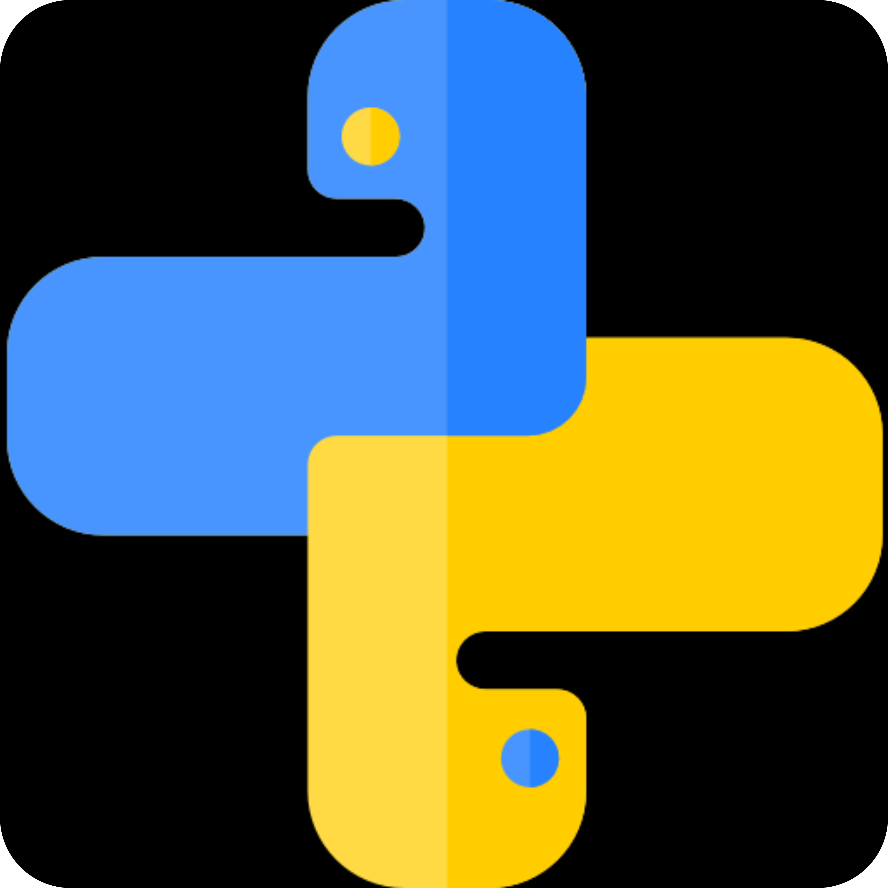
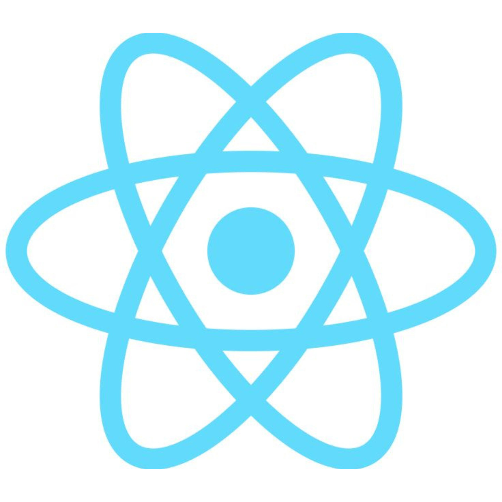
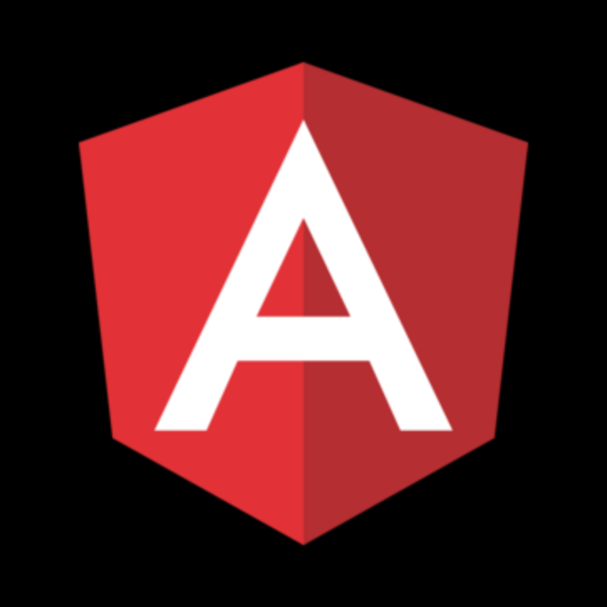
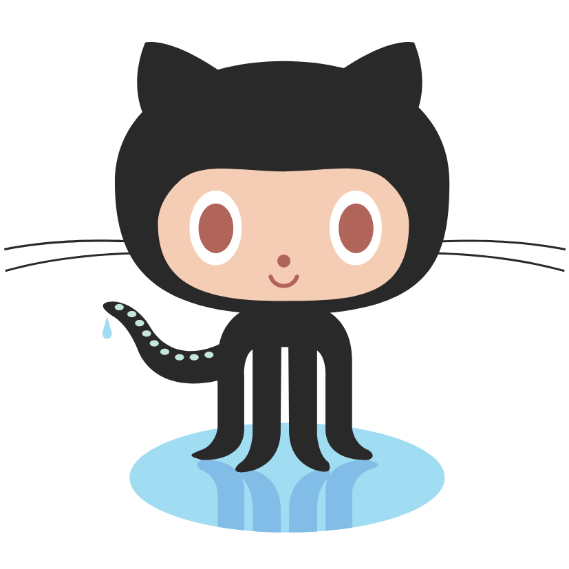
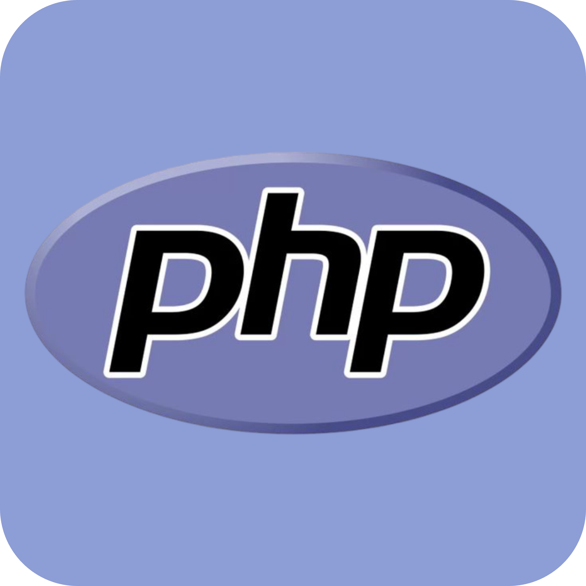
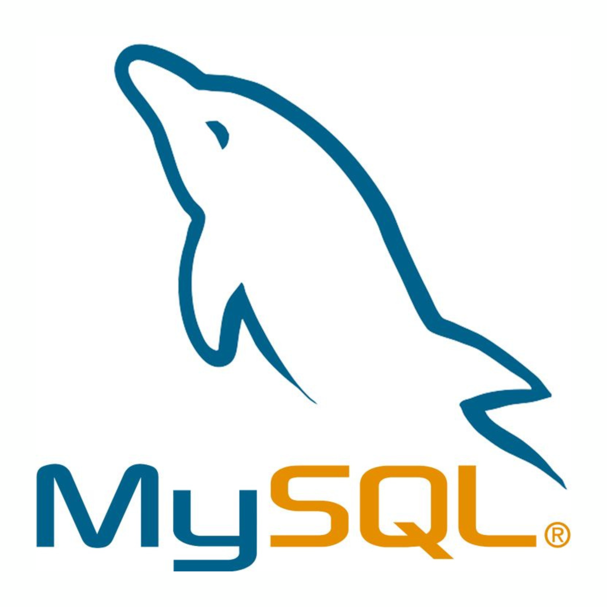
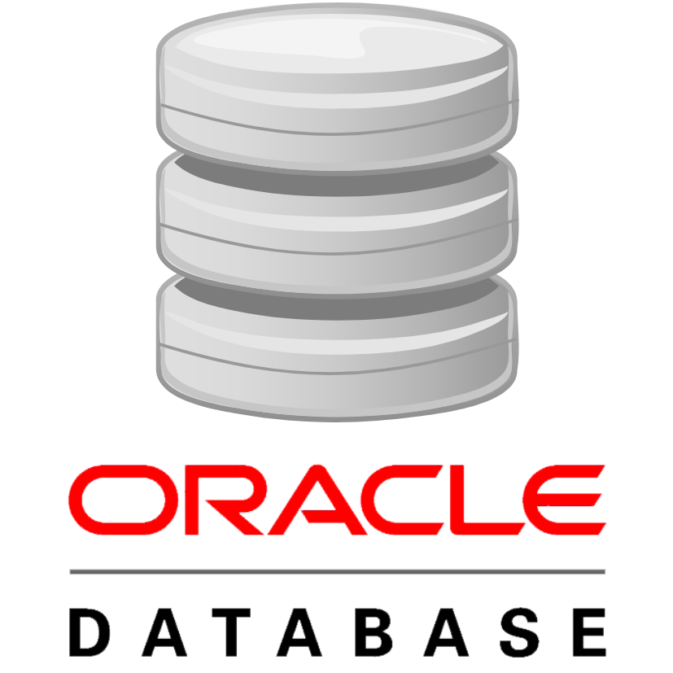
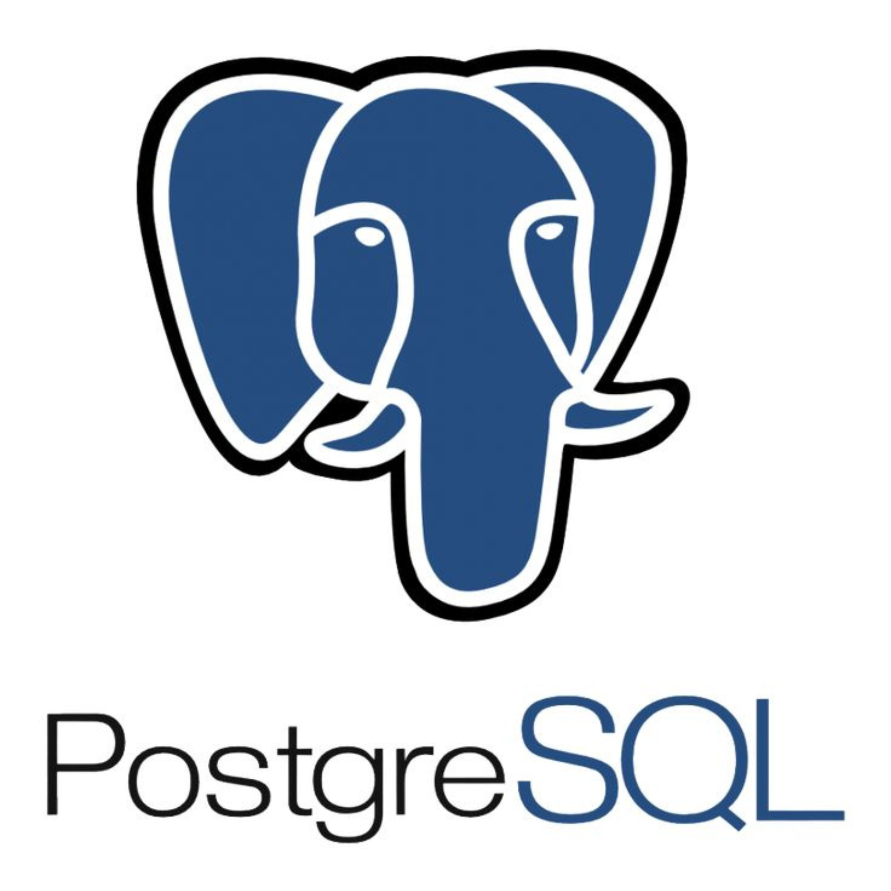
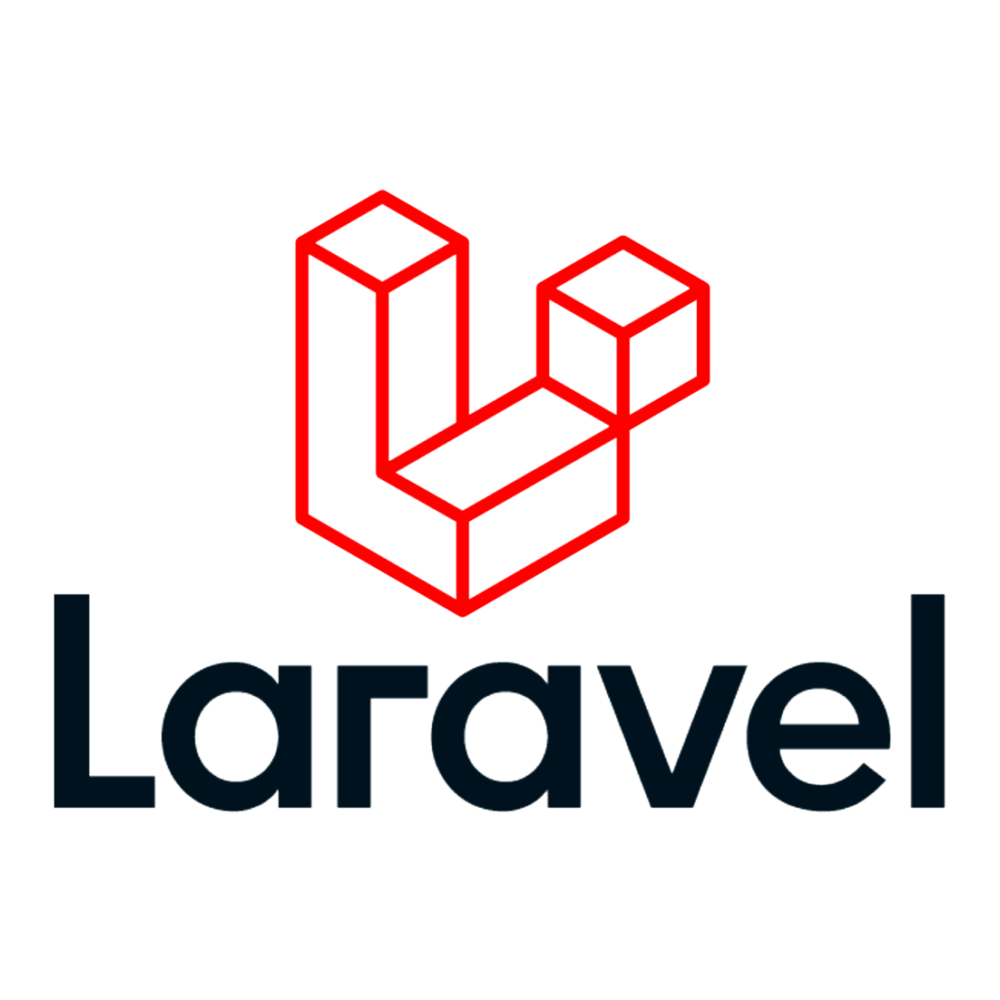

## Hello, I'm William García Marin 👋🏻

## About Me

I am passionate about technology and software development 💻, 
additional i like to practice:

⚽️ Football  
🥊 Box  
🎮 Gaming  

## 🚀 Technologies
  

## Links

